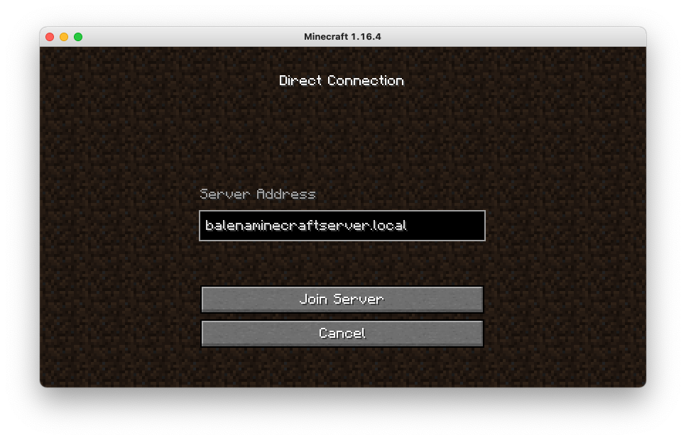

# A Minecraft server for the Raspberry Pi 4 :star2:
**Starter project enabling you a Mineccaft Server using just a Raspberry Pi.**

This project has been tested on and Raspberry Pi 4 B 4GB. We do not recommend using a Raspberry Pi 3 or deeper. They have not enough RAM and power to calculate all the things. :boom:

## Why balenaServer?

* It works out of the box, just start it and it just works. :+1:
* You can play anywhere. You can take the Pi to a friend, connect to his Wifi and enjoy playing. :video_game:
* It is free. No costs, no big server and no complication. :free:
* Why hosting on a computer? A Pi is power efficient! :rocket:
* You can easy maintain the files on the Pi by using your PC. :computer:

## Hardware required

* Raspberry Pi 4B (The best is 4GB. 1GB is not enough.) :tada:
* Micro SD Card (we recommend 8GB Sandisk Extreme Pro) :floppy_disk:
* Power supply :electric_plug:

## Software required

* A download of this project (of course)
* Software to flash an SD card ([balenaEtcher](https://balena.io/etcher))
* A free [balenaCloud](https://balena.io/cloud) account
* The [balena CLI tools](https://github.com/balena-io/balena-cli/blob/master/INSTALL.md)

## Setup and use :stars:

To run this project is as simple as deploying it to a balenaCloud application; no additional configuration is required.

### Setup the Raspberry Pi :cd:

* Sign up for or login to the [balenaCloud dashboard](https://dashboard.balena-cloud.com)
* Create an application, selecting the correct device type for your Raspberry Pi
* Add a device to the application, enabling you to download the OS
* Flash the downloaded OS to your SD card with [balenaEtcher](https://balena.io/etcher)
* Power up the Pi and check it's online in the dashboard

### Deploy this application :airplane:

* Install the [balena CLI tools](https://github.com/balena-io/balena-cli/blob/master/INSTALL.md)
* Login with `balena login`
* Download this project and from the project directory run `balena push <appName>` where `<appName>` is the name you gave your balenaCloud application in the first step.

## Connect to the server :satellite:

You can see in the Dashboard one IP-adress. It is the from your server. One example:

In my case is it `192.168.178.35`. You can connect to it like that:

Now you are the one with a balenaServer :sunglasses::

## Connect to the terminal :satellite:

The server has no console input option in the cloud dashboard, so you need `RCON`. It is a protocol for connecting to the server.
There are many clients, but you can pick one here:

* mcrcon: https://github.com/Tiiffi/mcrcon/releases

**NOTE:** You will need for starting this script this batchfile if you are using windows (Just paste it in the unzipped directory.): https://github.com/AlexProgrammerDE/RCON-Script/blob/master/launch.bat

## Connect to the file-directory :satellite:

You can connect to the server and change your serverfiles. I recommend using a Tool like [WinSCP](https://winscp.net/).
The IP is the one above, the protocoll `SCP`, the port `22`, the username `root` and the password is `balenaserver`.
The files are in the root directory folder `serverfiles`. 

## Update balenaServer :arrows_counterclockwise:

You can update balenaServer with doing the `git clone` and `balena` steps again, but if you don´t want to keep the world must you set before doing that stuff a enviroment variable. It is `CACHE_IGNORE`. It ignores the saved world temporary, until you delete the enviroment variable. The balena preconfigured world gets loaded.

**NOTE:** The Pi will restart. Don´t forget to delete the enviroment variable after that restart! 

## Double RAM (optional) :link:

Devices like the Raspberry Pi 4B 4GB have enough RAM to run the server with 2GB RAM. If you set `DOUBLE_RAM` to `true` will be the double of RAM used(2GB).

## Custom Server (optional) :eyeglasses:

You can also add with the scp feature new servers. You want something different, but don´t know where to start? Here are some servers listed:

* Spigot (Vanilla Java Edition): https://getbukkit.org/download/spigot
* Craftbuckit (Vanilla Java Edition): https://getbukkit.org/download/craftbukkit
* Vanilla from Minecraft (Vanilla Java Edition): https://getbukkit.org/download/vanilla
* Paper (Vanilla Java Edition): https://papermc.io/downloads
* Forge (Modded Java Edition): http://files.minecraftforge.net/
* Pocketmine-MP (Vanilla Pocket Edition): https://pmmp.readthedocs.io/en/rtfd/installation.html
* Bedrock from Microsoft (Vanilla Bedrock Edition): https://www.minecraft.net/de-de/download/server/bedrock/

Not satisfied:expressionless:? There are many tutorials, just google it. If you need help can you ask in an issue, but first google it. balenaServer uses Spigot, which is very good.  

This project is in active development so if you have any feature requests or issues please submit them here on GitHub. PRs are welcome, too.

Here is a little server demo (10 FPS):crown::

